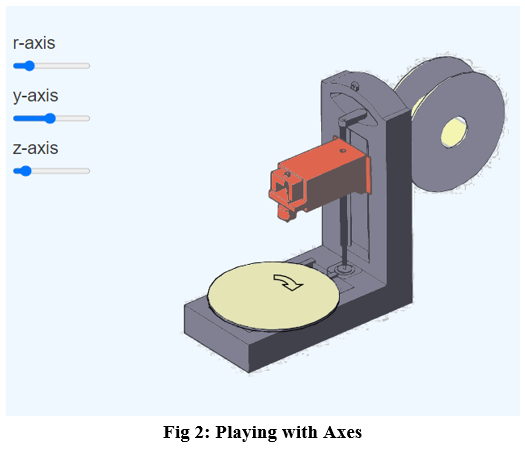

# Ex. No.4 SIMULATION OF POLAR 3D PRINTER MACHINE

### DATE: 

## AIM:
### To simulate the construction of polar 3D printer and to get in-depth knowledge of mechatronics of polar 3D printers.

## REQUIREMENTS:
### ●	System - Windows 7 or higher, 1 GB RAM.

## PROCEDURE:

## Assembly of Polar 3D Printer
### 1.	Select 'Assembly of Polar 3D Printer' from the visible list.
### 2.	All the parts related to Polar 3D Printer will be shown on the screen.
### 3.	Select the parts in sequence in which they are shown.
### 4.	When the first part is selected then it will open in the blank space in the left side of the screen.
### 5.	Further, when the correct part will be selected then it will get assembled with the previously selected part/parts.
### 6.	If the user follows an incorrect sequence then a pop-up will appear on the screen showing the name of the part to be selected.

## Playing with Axes
### 1.	Move the r-axis slider and observe the movement of the r-axis assembly.
### 2.	Move the y-axis slider and observe the movement of the y-axis assembly.
### 3.	Move the z-axis slider and observe the movement of the z-axis assembly.

## OUTPUT:

Y Axis Base :
In a polar 3D printer, the y-axis base is a rotating platform that controls movement along the y-axis. It enables circular or spherical motion in the x-y plane while the z-axis movement is achieved through linear motion.

Z-Axis Frame :
The Z-axis frame in a polar 3D printer is the structure that controls the vertical movement of the print head or build platform. It allows for precise adjustment of the height of the printed object in the polar coordinate system.

Smooth Rods :
Smooth rods in a polar 3D printer are cylindrical rods that provide stability and guidance for the movement of printer components. They support smooth and accurate rotation around the central point, enhancing the printer's performance and print quality.

Motors :
Motors in a polar 3D printer drive the movement of various printer parts. They can be stepper motors for precise positioning or servo motors for accurate control. Linear motors may also be used for linear motion. These motors work together with the printer's electronics to enable the necessary rotations and translations during printing.

Extruder Supporter :
The extruder supporter in a polar 3D printer is a component that holds and supports the extruder assembly. It ensures stability and proper alignment for accurate filament extrusion during the printing process.

Threaded Rod:
Threaded rods in a polar 3D printer provide stability and controlled vertical movement along the Z-axis. They are used with nuts or couplers to adjust and position components like the build platform. They are cost-effective and essential for accurate layer-by-layer printing.

Y-Axis Frame :
The Y-axis frame in a polar 3D printer supports and guides the horizontal movement from front to back. It provides stability and allows for precise positioning of the print head or build platform along the radial direction.

Motor with Gear :
A motor with gear in a polar 3D printer is a combination used to provide controlled rotational motion. The motor generates the force, while the gear mechanism enhances torque or speed to drive components like the print head or build platform with precision.

Motor with Pulley :
A motor with pulley in a polar 3D printer converts rotational motion into linear movement. The motor rotates, and the attached pulley transfers this motion to a belt or cable, allowing precise positioning of components like the print head or build platform along the radial direction.

Gears :
Gears in a polar 3D printer transmit rotational motion between components. They can adjust speed, torque, and direction of rotation. Gears ensure smooth and accurate movement, enhancing the printer's performance and reliability.

Plate :
In a polar 3D printer, the "plate" refers to the build plate or print bed. It is a flat surface where the printed object is created and adheres during printing. The plate provides stability and a level surface for accurate printing.

Extruder :
The extruder in a polar 3D printer feeds, melts, and deposits the filament material for printing. It consists of a motor, filament drive, and hot end. It melts and extrudes the filament through a nozzle to create the printed object.

Filament :
Filament in a polar 3D printer is the material used for printing. It is a thin strand supplied on a spool and is melted and deposited layer by layer to create the printed object. Different types of filament with varied properties and colors are available for different printing needs.

## Output:

### Name:NITEESH.M
### Register Number:212222230098

## Result: 
### Thus the simulation on construction of polar 3D printer is completed & movement of axis along X, Y, & Z has been studied.
